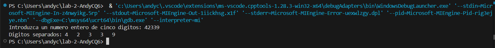

# Ejercicio de laboratorio 3 - Separación de dígitos

## Descripción

Es s cada uno. [Sugerencia: use la división entera y el operador de módulo.] Por ejemplo, si el usuario ingresa 42339, el programa debe imprimir lo que se muestra en la salida de ejemplo.

```cmd
Introduzca un número entero de cinco dígitos: 42339
Dígitos separados: 4 2 3 3 9
```

## Contesta las siguientes preguntas

1. ¿Cuáles son los resultados de las siguientes expresiones?

   | Operación  | Resultado |
   | ---------- | --------- |
   | 24 / 5     |     8     |
   | 18 % 3     |     0     |
   | 13 % 9     |     4     |
   | 13 / 2 % 2 |     25    |

2. ¿Qué sucede cuando el usuario ingresa un número que tiene menos de cinco dígitos? ¿Por qué? ¿Cuál es la salida cuando se ingresa 1763?

   R. Imprime los números separados, y la "casilla" faltante es llenada con un cero, porque el programa solo divide el cero y lo agrega, a pesar de que no nos es de mucha ayuda.

3. El programa que completó en este ejercicio de laboratorio ingresa un número con varios dígitos y separa los dígitos. Escribe un programa inverso, un programa que le pide al usuario tres números de un dígito y los combina en un solo número de tres dígitos.

## ✅ Resultado

